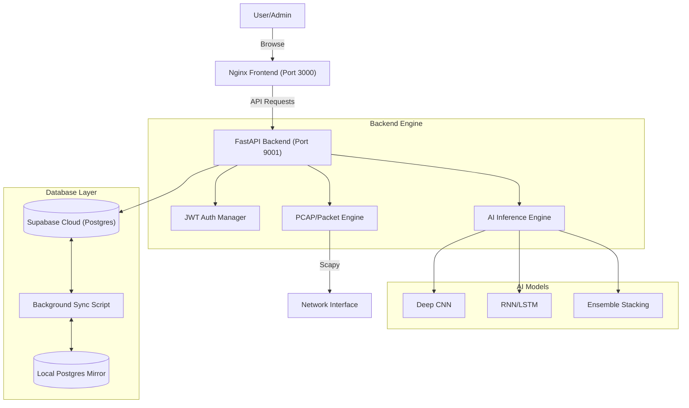

# 📋 IDS-ML v2.0 — Complete Project Specification

> **Intrusion Detection System using Machine Learning**
> A full-stack, enterprise-grade network intrusion detection system leveraging Deep Architecture (CNN/LSTM) and Multimodal Ensembles, with real-time packet interception and cloud data synchronization.

---

## 📌 Table of Contents

- [1. Project Overview](#1-project-overview)
- [2. Problem Statement & Objectives](#2-problem-statement--objectives)
- [3. System Architecture](#3-system-architecture)
- [4. Tech Stack](#4-tech-stack)
- [5. Machine Learning Pipeline](#5-machine-learning-pipeline)
- [6. API Specification](#6-api-specification)
- [7. Frontend Dashboard](#7-frontend-dashboard)
- [8. Data Persistence & Synchronization](#8-data-persistence--synchronization)
- [9. Containerization & Deployment](#9-containerization--deployment)
- [10. Project File Structure](#10-project-file-structure)

---

## 1. Project Overview

**IDS-ML v2.0** is an advanced **Network Intrusion Detection System (NIDS)** that monitors live network traffic or analyzes historical PCAP files to classify traffic into legitimate or malicious categories. It uses a hybrid ensemble approach to ensure maximum detection accuracy across diverse attack vectors.

### Core Capabilities

| Capability | Description |
|---|---|
| **Live Traffic Analysis** | Sniffs real-time packets using `Scapy` and extracts 12+ critical network features for instant classification. |
| **PCAP Forensic Analysis** | Supports uploading `.pcap` and `.pcapng` files for batch processing and threat hunting. |
| **Hybrid Ensemble Model** | Combines CNNs, LSTMs, and Gradient Boosted Trees (XGBoost/LightGBM) for robust detection. |
| **Multi-Tier Persistence** | Uses Supabase (PostgreSQL) as the primary cloud store with local SQLite/PostgreSQL mirrors. |
| **Containerized Workflow** | Fully orchestrated with Docker Compose, separating the Nginx-hosted frontend and FastAPI backend. |
| **Enterprise Security** | JWT-based authentication with role-based access control (Admin, Analyst, Viewer). |

---

## 2. Objectives & Scope

### Objectives
1. **High Accuracy**: Achieve **≥95% accuracy** on modern network threat datasets (CICIDS2017 & NSL-KDD).
2. **Low Latency**: Real-time inference with under **50ms** processing time per packet.
3. **Scalability**: Decoupled architecture ready for cloud deployment (AWS/Azure/GCP).
4. **User Experience**: Premium, dark-themed dashboard with real-time data visualization via Chart.js.

### Scope
- **Datasets**: NSL-KDD and CICIDS2017.
- **Algorithms**: CNN, LSTM, Random Forest, XGBoost, LightGBM.
- **Encoding**: Label Encoding and Standard Scaling.
- **Traffic Support**: TCP, UDP, ICMP.

---

## 3. System Architecture



---

## 4. Tech Stack

### Backend & AI
- **FastAPI**: Main API framework.
- **TensorFlow/Keras**: Deep learning (CNN/LSTM) models.
- **XGBoost/LightGBM/Scikit-Learn**: Ensemble and traditional ML.
- **Uvicorn**: High-performance ASGI server.
- **SQLAlchemy**: ORM for database management.

### Database
- **Supabase**: Primary cloud-hosted PostgreSQL.
- **PostgreSQL**: Local redundant mirror for high availability.
- **SQLite**: Automatic fallback for offline development.

### Frontend
- **Vanilla JavaScript (ES6+)**: Core logic and API integration.
- **Nginx**: High-performance static web server (Dockerized).
- **Bootstrap 5 & Chart.js**: UI components and live graphing.

---

## 5. Machine Learning Pipeline

### 12 Critical Features
The system prioritizes 12 features for rapid real-time classification:
1. `duration`
2. `protocol_type`
3. `service`
4. `flag`
5. `src_bytes`
6. `dst_bytes`
7. `logged_in`
8. `count`
9. `srv_count`
10. `serror_rate`
11. `srv_serror_rate`
12. `dst_host_srv_count`

### Ensemble Logic
- **Stacking**: Base models pass predictions to a meta-classifier.
- **Voting**: Soft-voting based on weighted probabilities of CNN/LSTM/RF.

---

## 6. API Specification

| Method | Path | Description |
|---|---|---|
| `POST` | `/login` | Authenticate and receive JWT token. |
| `POST` | `/pcap/upload` | Upload `.pcap` for analysis. |
| `GET` | `/live/start` | Trigger real-time capture session. |
| `GET` | `/analytics/stats` | Fetch aggregate threat data. |
| `POST` | `/predict` | Single feature-set classification. |

---

## 7. Containerization & Deployment

### `docker-compose.yml` Services
- **ids-ml-backend**: Port `9001:8000`. Environment controlled via `.env`. Contains all ML logic.
- **ids-ml-frontend**: Port `3000:80`. Nginx-based static host serving the web dashboard.

### Deployment Summary
```bash
docker compose up --build -d
```
Access points:
- **Frontend**: `http://localhost:3000`
- **API/Docs**: `http://localhost:9001/docs`

---

## 8. Author
**V33R-5H4H**
*Lead Developer & AI Architect*
